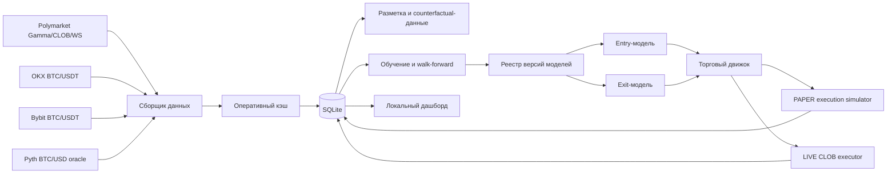

# PolyR: полное описание проекта

## 1. Назначение

PolyR — локальная исследовательская система для автоматизированного анализа и торговли краткосрочными событиями Polymarket вида **BTC Up or Down — 5 minutes**.

Система решает четыре связанные задачи:

1. непрерывно собирает рыночные данные Polymarket и внешние цены BTC;
2. формирует размеченный датасет для исследования и обучения моделей;
3. исполняет решения моделей в реалистичном PAPER-режиме либо, только после ручного переключения, в LIVE;
4. показывает состояние проекта, действия моделей и экономические результаты на локальном дашборде.

Главная цель проекта — не максимизация количества сделок или win rate, а устойчивый положительный **чистый PnL после комиссий, спреда, задержек и неисполненных лимитных заявок**. До статистически убедительной PAPER-проверки LIVE должен рассматриваться как экспериментальный canary-режим с малым капиталом.

## 2. Торгуемое событие

Каждое событие длится пять минут и имеет два взаимоисключающих исхода:

- `Up` — итоговая цена BTC находится выше Price to Beat;
- `Down` — итоговая цена BTC находится ниже Price to Beat.

Вероятности относятся к положению финальной цены относительно **Price to Beat**, а не относительно цены входа в контракт. Цена контракта Polymarket определяет стоимость позиции и потенциальную выплату, но не целевую переменную модели направления.

Разрешённое окно нового входа:

- не раньше 15-й секунды события;
- не позже чем за 15 секунд до окончания.

Модель не обязана входить в начале события. Она может ждать более информативную точку и выставлять лимитную заявку позднее.

## 3. Общая архитектура



Один launcher запускает три долгоживущих сервиса:

- `collector` — сбор и нормализация данных;
- `trading` — решения моделей, PAPER/LIVE-заявки и расчёт позиций;
- `dashboard` — API и интерфейс мониторинга.

Манифест процессов защищает проект от независимого двойного запуска сервисов. В Windows один сервис может отображаться как пара `venv launcher → базовый Python`; это одна родительско-дочерняя цепочка, а не обязательно дублирующий движок.

## 4. Источники данных

### Polymarket

Используются:

- Gamma API — поиск и описание событий;
- CLOB REST/WebSocket — стакан, bid/ask, токены исходов и заявки;
- Data API — дополнительная рыночная информация;
- официальный исход события для финальной разметки.

Для каждого наблюдения важны:

- event slug и временные границы;
- Price to Beat;
- текущая reference-цена BTC;
- остаток времени;
- bid/ask, midpoint, spread и глубина стакана для `Up` и `Down`;
- возраст данных и задержка источника.

### Внешняя цена BTC

Текущая конфигурация предусматривает сверку с:

- OKX;
- Bybit;
- Pyth oracle.

Chainlink RTDS отключён из активной схемы из-за наблюдавшейся задержки. Binance, CryptoRank, Gemini и X не входят в текущий обязательный пайплайн.

Внешние источники нужны для контроля качества reference-цены, оценки расхождения источников и построения признаков направления/волатильности. Они не заменяют официальный механизм определения исхода Polymarket.

## 5. Хранение данных

Основная база:

```text
данные/market_data.sqlite3
```

Дополнительная offline-база контрфактического обучения:

```text
данные/offline_counterfactual_training.sqlite3
```

В базе сохраняются:

- нормализованные снимки рынка;
- события и финальные исходы;
- решения моделей и объясняющие tags;
- лимитные заявки, статусы и исполнения;
- PAPER- и LIVE-позиции раздельно;
- комиссии, realized/unrealized PnL и equity;
- shadow-предсказания;
- контрфактические действия;
- сведения о версиях моделей и торговых сессиях.

Технические проверки исполнения помечают записи полями валидности и причинами отклонения. Невозможные сделки — вход после события, невалидная цена, устаревший стакан — не должны участвовать в честном PnL.

Для долговременного хранения предусмотрен Parquet-архив. SQLite остаётся оперативным источником для дашборда и движка, а Parquet удобен для крупных обучающих выборок и последовательного хранения истории.

## 6. Разметка и признаки

Целевая информация включает:

- финальный исход `Up/Down`;
- чистый PnL действия после комиссии;
- PnL при фактическом раннем выходе;
- контрфактический PnL при HOLD до resolution;
- вероятность и факт исполнения лимитной заявки;
- качество входа, выхода и пропуска.

Основные группы признаков:

- расстояние текущей цены BTC до Price to Beat;
- знак и величина движения цены;
- время с начала и до окончания события;
- краткосрочный momentum и волатильность;
- режим рынка: тренд, флэт, повышенная волатильность;
- цены внешних источников и их расхождение;
- bid/ask, spread, midpoint, глубина и свежесть стакана;
- стоимость контрактов `Up/Down`;
- история соседних 5-минутных событий;
- состояние открытой позиции, peak/trough и drawdown после входа;
- выбранная модель и версия конфигурации.

История соседних событий исследуется отдельным walk-forward-экспериментом: без истории, с 3 и с 12 предыдущими событиями. Признаки истории нельзя строить с использованием будущих данных.

## 7. Модели

### Числовые модели

- `CatBoost` — табличная модель вероятности направления и/или торгового действия;
- `custom` — собственная обученная модель проекта;
- модели value, fill probability, market regime и exit value.

### Локальные LLM

- `Qwen2.5-1.5B-Instruct`;
- `Gemma 3 1B`;
- Qwen QLoRA-эксперимент.

LLM не должна подменять измеряемую probability-модель свободным текстом. Её вывод используется только в той форме, которую можно проверить offline и сопоставить с PnL.

### Отдельные роли entry и exit

На вход и выход выбираются отдельные модели:

- entry-модель оценивает вероятность `Up/Down`, момент, цену и размер входа;
- exit-модель сравнивает `CLOSE` с `HOLD` только для уже удерживаемого направления.

Это разделение принципиально: условия открытия и условия закрытия асимметричны. Выход может быть легче входа, но не должен автоматически срабатывать только из-за небольшого текущего плюса.

## 8. Логика входа

Направление выбирается по калиброванной вероятности исхода относительно Price to Beat. Value-слой выбирает лимитную цену и размер, но не должен незаметно инвертировать направление entry-модели.

Оцениваются кандидаты:

- `WAIT`;
- `BUY_UP` по bid/midpoint/ask;
- `BUY_DOWN` по bid/midpoint/ask;
- размеры позиции из разрешённых уровней.

Value учитывает:

- вероятность выигрыша;
- цену контракта;
- комиссию;
- вероятность исполнения;
- ожидаемый PnL после исполнения;
- риск хвостового убытка.

Ключевое двухэтапное представление лимитной заявки:

```text
P(fill) × E(PnL | fill)
```

Вероятность исполнения и прибыль после исполнения моделируются раздельно, поскольку хорошая теоретическая цена бесполезна, если заявка почти никогда не исполняется.

### Активный PAPER-сбор

Для ускорения накопления информации включён специальный PAPER-only режим:

- большую часть события модель может ждать сильный сигнал;
- если позиции нет, в последние 90 секунд разрешённого окна выбирается лучший исполнимый вход;
- пропуск сохраняется при почти случайной уверенности ниже 54%, плохих данных, закрытом окне или отсутствии валидной лимитной цены;
- режим не форсирует LIVE и не искажает shadow-турнир.

Это исследовательский механизм увеличения покрытия событий, а не утверждение, что любая сделка экономически выгодна. Результаты активного сбора должны анализироваться отдельно от свободной profit-seeking policy.

## 9. Логика выхода

Для открытой позиции модель фиксирует удерживаемое направление и сравнивает:

- ожидаемую ценность `HOLD`;
- немедленный `CLOSE` после комиссии и доступного bid;
- вероятность ухудшения исхода относительно Price to Beat.

Перевороты позиции отключены: возможны `HOLD`, `CLOSE` и предусмотренные эксперименты частичного выхода. При отсутствии сигнала разворота позиция может удерживаться до resolution, чтобы не терять значительную часть выплаты из-за преждевременной фиксации.

Для каждого раннего выхода рассчитывается сравнение с контрфактическим HOLD:

```text
Early-exit PnL − Hold-to-resolution PnL
```

Это позволяет обучать exit-модель на фактической цене закрытия и на том, что случилось бы без выхода.

## 10. Исполнение заявок

### PAPER

PAPER — не мгновенная покупка по нарисованной цене. Симулятор учитывает:

- GTD limit для входа;
- срок жизни заявки;
- очередь перед заявкой;
- доступную глубину;
- ограничение участия в стакане;
- latency и jitter;
- partial fill и non-fill;
- комиссию Polymarket;
- свежесть стакана;
- допустимое окно события.

### LIVE

LIVE использует CLOB executor и реальные credentials из локального `api_config.py`. Переключение выполняется вручную на дашборде. Если позиция уже открыта, смена режима откладывается до безопасной границы сделки.

LIVE никогда не должен включаться только изменением файла при запуске. Перед реальными заявками проверяются:

- ключи и signature type;
- funder address;
- CLOB credentials;
- геодоступность;
- баланс и allowance;
- kill switch;
- лимиты позиции и убытка;
- корректность стакана и цены.

## 11. Управление риском

Базовые ограничения проекта:

- начальный PAPER-капитал — `$300`;
- обычный размер — примерно `$2–3`;
- до `$5` при высокой уверенности;
- не более `$10` экспозиции на событие;
- максимум одна свежая позиция на событие;
- остановка после 10 последовательных убытков;
- отдельные дневные и LIVE-canary лимиты;
- ручной kill switch.

Размер заявки может масштабироваться пользовательским множителем, однако абсолютные лимиты риска продолжают действовать.

## 12. PAPER, LIVE и shadow

- `PAPER` — виртуальный капитал с реалистичным исполнением;
- `LIVE` — реальные заявки и отдельный учёт фактического исполнения;
- `shadow` — несколько моделей получают одинаковые события, но не управляют капиталом.

PAPER и LIVE должны отображаться и анализироваться раздельно. Для оценки разрыва используются:

- requested price против filled price;
- fill rate;
- latency;
- комиссии;
- partial/non-fill;
- расхождение решения и реального исполнения;
- разница PnL.

## 13. Метрики

Основные экономические метрики:

- Net PnL после комиссий;
- equity curve;
- expectancy на сделку;
- profit factor;
- ROI;
- max drawdown;
- средняя прибыль и потеря;
- payoff ratio;
- win rate и нижняя граница Wilson;
- серии прибылей/убытков;
- early exit против HOLD.

Метрики моделей:

- ROC-AUC;
- Brier score;
- calibration;
- Up/Down balance;
- precision/recall для торговых действий;
- fill ROC-AUC/Brier;
- temporal walk-forward PnL;
- bootstrap confidence interval PnL.

Высокий win rate сам по себе недостаточен: стратегия может часто фиксировать небольшую прибыль и редко получать крупный убыток. Главная метрика — долгосрочный чистый PnL с доверительным интервалом.

## 14. Версионирование и эксперименты

После изменения признаков, данных, гиперпараметров или policy модель сохраняется как новая неизменяемая версия:

```text
model_name_v0001
model_name_v0002
...
```

Вместе с версией сохраняются:

- период и объём обучения;
- признаки и гиперпараметры;
- offline-метрики;
- стратегия исполнения;
- события и торговые результаты;
- причина promotion/rejection.

Положительно торговавшие версии архивируются и не обязаны постоянно находиться в памяти.

Основные эксперименты проекта:

- честный shadow-турнир на одинаковых событиях;
- walk-forward без утечки будущего;
- история 0/3/12 соседних событий;
- проверка гипотезы разворота после убыточного события;
- частичный выход против полного выхода и HOLD;
- Qwen inversion;
- QLoRA;
- market-regime entry;
- `P(fill) × E(PnL | fill)`;
- PAPER/LIVE execution gap.

## 15. Дашборд

Локальный адрес по умолчанию:

```text
http://127.0.0.1:8765/
```

Дашборд отображает:

- состояние collector/trading/dashboard;
- свежесть и задержку источников;
- активное событие и Price to Beat;
- выбранные entry/exit-модели и версии;
- PAPER и LIVE раздельно;
- позиции, заявки и исполнения;
- entry/exit price, направление и размер;
- текущий и финальный PnL;
- early exit против HOLD;
- equity curve;
- shadow-турнир;
- offline-метрики;
- live-readiness условия;
- журнал решений.

Через панель можно управлять режимом, моделями и множителем размера. Выбор модели разрешён в любое время, но применяется после закрытия текущей позиции либо на безопасной границе события.

## 16. Структура проекта

```text
poly_project/
├── app_config.py                  # параметры и гиперпараметры
├── api_config.py                  # локальные секреты, не хранится в Git
├── api_config.example.py          # безопасный шаблон
├── запустить_проект.py            # единая точка запуска
├── запустить_демо.py              # отдельный PAPER launcher
├── запустить_реальную_торговлю.py # отдельный LIVE launcher
├── исходный_код/polybot/          # основной Python-пакет
├── запуск/                        # служебные точки запуска
├── тесты/                         # автоматические тесты
├── служебные_скрипты/             # аудит, обучение и эксперименты
├── настройка_проекта/             # requirements и GPU-план
├── документация/                  # тематические документы
├── данные/                        # SQLite/Parquet, не хранится в Git
├── модели/                        # веса, версии и отчёты, не хранится в Git
└── журналы/                       # runtime-логи, не хранится в Git
```

## 17. Быстрый запуск

### Установка

```powershell
git clone git@github.com:kozgunov/polyr.git
cd polyr
py -3.12 -m venv .venv
.\.venv\Scripts\python.exe -m pip install -U pip
.\.venv\Scripts\python.exe -m pip install -r .\настройка_проекта\requirements.txt
Copy-Item .\api_config.example.py .\api_config.py
```

После этого заполните `api_config.py`, перенесите базы и модели.

### PAPER

```powershell
.\.venv\Scripts\python.exe .\запустить_проект.py restart --mode paper
```

### Проверка состояния

```powershell
.\.venv\Scripts\python.exe .\запустить_проект.py status --no-browser
```

### Остановка

```powershell
.\.venv\Scripts\python.exe .\запустить_проект.py stop
```

### Тесты

```powershell
.\.venv\Scripts\python.exe -m pytest -q
```

## 18. Перенос на новый компьютер

GitHub содержит код, тесты, документацию и безопасные шаблоны. Отдельно нужно перенести:

- `api_config.py`;
- `данные/market_data.sqlite3`;
- `данные/offline_counterfactual_training.sqlite3`;
- всю папку `модели/` для сохранения точных версий и результатов.

Перед копированием SQLite остановите старый проект:

```powershell
.\.venv\Scripts\python.exe .\запустить_проект.py stop
```

После копирования сравните SHA256 на обоих устройствах:

```powershell
Get-FileHash .\данные\market_data.sqlite3 -Algorithm SHA256
Get-FileHash .\данные\offline_counterfactual_training.sqlite3 -Algorithm SHA256
```

Базовые Qwen/Gemma можно скачать заново, но CatBoost/custom, QLoRA adapters, checkpoints, архив версий и отчёты экспериментов нужно либо перенести, либо переобучить на перенесённой базе.

Штатная установка/переобучение моделей:

```powershell
.\.venv\Scripts\python.exe .\установить_модели.py
```

## 19. Секреты и Git

В Git запрещено добавлять:

- `api_config.py`;
- private key и CLOB credentials;
- Telegram/Hugging Face/LLM tokens;
- `.env` и session-файлы;
- SQLite и Parquet;
- веса и checkpoints;
- runtime-журналы.

Они исключены `.gitignore`. Перед каждым публичным push необходимо проверять staged-файлы на секреты и крупные бинарники.

## 20. Известные ограничения

- Пять минут дают мало времени на устойчивую оценку и исполнение.
- Рыночная цена контракта уже агрегирует ожидания участников, поэтому direction accuracy не равна прибыльности.
- PAPER всегда является приближением LIVE, даже при моделировании очереди и latency.
- Небольшая выборка и несбалансированное направление создают ложную уверенность.
- Дрифт режима BTC способен быстро ухудшить ранее сильную конфигурацию.
- Частые принудительные сделки полезны для сбора данных, но могут ухудшать PnL.
- LLM на слабом оборудовании повышает задержку и не гарантирует преимущество над табличной моделью.

## 21. Критерий готовности к LIVE

Решение о LIVE нельзя принимать по нескольким прибыльным часам. Нужны:

- достаточное число независимых событий;
- положительный чистый PnL;
- положительная нижняя граница доверительного интервала PnL;
- приемлемый max drawdown;
- стабильность в нескольких временных режимах;
- отсутствие direction collapse;
- хорошая калибровка и Brier score;
- подтверждённая реалистичность PAPER execution;
- небольшой PAPER/LIVE gap;
- полностью работающие kill switch и лимиты.

Даже после прохождения критериев первый LIVE-запуск выполняется как ограниченный canary-тест и не является гарантией будущей прибыли.

## 22. Текущее направление развития

Приоритеты проекта:

1. накопить больше валидных PAPER-событий с активным сбором;
2. разделять свободную profit-policy и forced-collection выборки;
3. дообучать entry и exit независимо;
4. развивать fill probability и conditional PnL модели;
5. сравнивать контекст 0/3/12 событий только через temporal walk-forward;
6. измерять drift и автоматически отклонять деградировавшие версии;
7. переносить обучение sequence/QLoRA на GPU-компьютер;
8. принимать promotion-решения по независимому OOS PnL, а не по train-метрикам.

---

Документ описывает архитектуру и текущие проектные соглашения. Фактические значения параметров находятся в `app_config.py`, а актуальные версии моделей — в локальном `модели/реестр_версий.json`.
